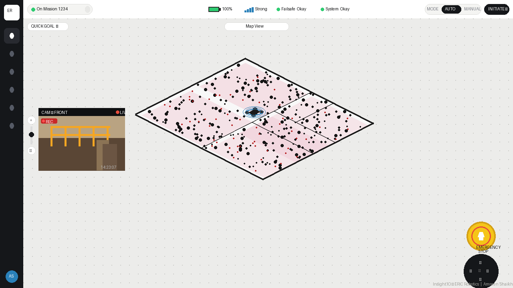

# Insight.IO Dashboard — ERIC Robotics Assignment
**Submitted by: Amreen Shaikh**

---

## Quick Start (Run Locally)

### Option 1 — Python
```bash
cd eric-robotics-insight
python3 -m http.server 8080
# Open: http://localhost:8080
```

### Option 2 — Node.js
```bash
cd eric-robotics-insight
npx serve .
# Open: http://localhost:3000
```

### Option 3 — VS Code
Install **Live Server** extension → right-click `index.html` → **Open with Live Server**

> ✅ No build step, no npm install, runs instantly.

---

## Features Implemented

| Feature | Status |
|---|---|
| Sidebar navigation (5 icons + avatar) | ✅ |
| Status bar — battery drain (live), signal, failsafe, system | ✅ |
| AUTO / MANUAL mode toggle | ✅ |
| SVG floor plan with LiDAR scan artifacts | ✅ |
| Robot marker — auto-moves in AUTO mode | ✅ |
| Robot path trail (dashed blue) | ✅ |
| Animated ping ring on robot | ✅ |
| Camera view — Three.js 3D warehouse scene | ✅ |
| Camera: live timestamp overlay | ✅ |
| Camera: crosshair overlay | ✅ |
| Zoom slider controls | ✅ |
| Quick Goal button | ✅ |
| Emergency STOP button | ✅ |
| D-pad directional controls | ✅ |
| Keyboard controls (WASD / Arrow keys / Space=STOP) | ✅ |
| INITIATE mission button | ✅ |
| Toast notifications (slide-in, auto-dismiss) | ✅ |
| Responsive layout | ✅ |

---

## Keyboard Shortcuts

| Key | Action |
|---|---|
| `W` / `↑` | Move robot forward |
| `S` / `↓` | Move robot backward |
| `A` / `←` | Move robot left |
| `D` / `→` | Move robot right |
| `Space` | Emergency STOP |

---

## Architecture & Design Decisions

### Single-file approach
Zero build toolchain — runs on any static file server. No npm, no webpack.
Perfect for local self-hosting as required by the assignment.

### Three.js camera scene
The camera feed uses Three.js to render a real-time 3D warehouse scene (floor, walls, safety fencing, boxes) with a slightly animated camera — simulating a live robot camera feed without needing a video file.

### SVG floor plan
The 2D map is a pure SVG with:
- Programmatically placed LiDAR scan artifact dots (matching reference screenshot)
- Highlighted pink zones (restricted/active areas)
- Interior wall structure matching the reference layout
- Animated robot marker with ping ring

### Robot autonomy simulation
In AUTO mode, the robot moves autonomously using randomised deltas within bounds. In MANUAL mode, it responds only to D-pad/keyboard input.

---

## Extending with Real Data

### Real camera feed
```html
<!-- Replace Three.js canvas with: -->
<video autoplay muted playsinline src="YOUR_STREAM_OR_FILE.mp4"></video>
```

### Real PCD point cloud (3D map view)
```js
// Three.js PCDLoader (already imported)
const loader = new THREE.PCDLoader();
loader.load('./data/scan.pcd', (points) => {
  points.material.size = 0.005;
  scene.add(points);
});
```

### ROS2 integration
```js
const ros = new ROSLIB.Ros({ url: 'ws://localhost:9090' });
const odom = new ROSLIB.Topic({
  ros, name: '/odom',
  messageType: 'nav_msgs/Odometry'
});
odom.subscribe(msg => {
  rX = msg.pose.pose.position.x * MAP_SCALE + OFFSET_X;
  rY = msg.pose.pose.position.y * MAP_SCALE + OFFSET_Y;
  updateRobot();
});
```

---

## Preview



## Tools Used
- Vanilla HTML / CSS / JavaScript
- Three.js r128 (CDN) — 3D camera scene rendering
- SVG — floor plan and robot marker
- CSS animations — robot ping, battery, live dot, toast notifications
